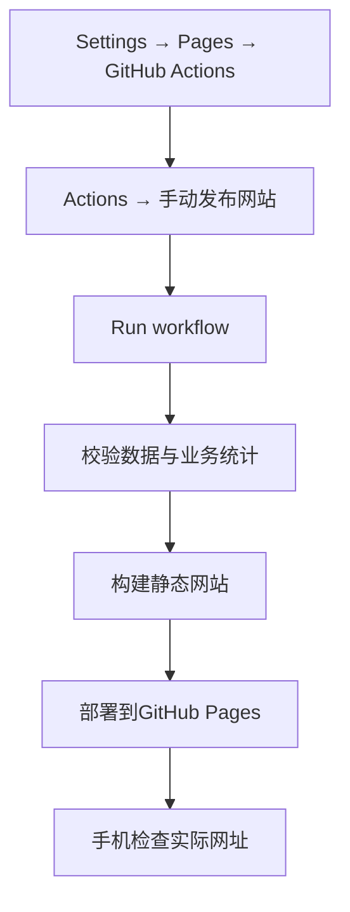

# GitHub Pages首次发布

本地交付已准备；首次公开发布需先审阅。批准后，使用用户或年级组织的仓库，名称建议为`DEP-DirectPhD-Guide`。

## 先检查公开内容

可以公开：本项目源码、维护说明、官方教师资料、标注假设的招生数字、匿名去向汇总、公开资料链接。

不提交：腾讯文档导出的Excel、具名原始调查、联系方式、私人凭据、`.env`、`local-imports/`、`local-snapshots/`、`node_modules/`、`dist/`、上级科研文件夹。`.gitignore`已排除这些常用路径和Excel/CSV/ZIP文件；发布前仍检查本次文件清单。

## 1. 建仓库并上传

在GitHub新建公开仓库`DEP-DirectPhD-Guide`。免费Pages方案采用公开仓库，源码和提交历史也可被他人查看。

仓库根目录必须直接包含`package.json`、`pnpm-lock.yaml`、`src/`、`public/`和`.github/workflows/pages.yml`。如果把整个项目目录再套一层上传，默认工作流会找不到配置。建议用GitHub Desktop添加本项目目录后发布，这样隐藏的`.github`目录也能被正确提交。

```text
仓库根目录
├─ package.json
├─ pnpm-lock.yaml
├─ src/
├─ public/
└─ .github/workflows/pages.yml
```

## 2. 启用Pages

```text
仓库页面
  Settings
    Pages
      Build and deployment
        Source: GitHub Actions
```

不选择“Deploy from a branch”。工作流自己构建网站；不用上传`dist`。

## 3. 手动发布



```text
仓库页面
  Actions
    手动发布网站
      Run workflow
        Branch: main（或实际默认分支）
          Run workflow
```

依次完成“校验数据与业务统计”“构建静态网站”“部署到GitHub Pages”。三步全部成功才算发布成功；前面的校验失败会阻止部署。默认仅允许手动触发，提交代码不会立即发布。

首次发布后，地址通常是：`https://<GitHub账号>.github.io/DEP-DirectPhD-Guide/`。以GitHub Pages设置或部署任务实际给出的地址为准；本地预览没有公共访问地址。

## 4. 发布验收

- 手机浏览器、微信、校园Wi-Fi和手机流量各打开一次。
- 点开三个页面、切换年度、展开导师、点击官方来源，刷新“年级去向”页面。
- 检查页脚快照日期和数据口径，56人是否仍为估算，2023级是否仍为占位。
- 若已填写腾讯文档链接，用非维护者账号验证分享权限。
- 记录发布日期、提交编号、部署网址和维护人，存入交接记录。

## 常见问题

| 现象 | 检查方法 |
| --- | --- |
| 没有Run workflow入口 | 工作流是否在仓库默认分支，是否允许Actions，当前账号是否有权限 |
| 构建找不到package.json | 检查是否多套一层目录 |
| 404或部署授权失败 | 检查Settings→Pages是否选GitHub Actions，以及仓库是否符合Pages条件 |
| 数据未改变 | 腾讯文档编辑不会自动同步；检查是否重新导出、导入、提交并手动发布 |
| 数据校验失败 | 查看任务中的中文表名和行号；不要跳过校验部署 |
| 微信访问异常 | 在手机浏览器复查，记录网络和错误；不要仅凭一次成功断言所有网络稳定 |

后续发布重复“导出→导入→预览→提交→Run workflow”。发布过程中维护者电脑可以关机，线上构建和托管由GitHub完成。

相关官方说明：[GitHub Pages自定义工作流](https://docs.github.com/en/pages/getting-started-with-github-pages/using-custom-workflows-with-github-pages)、[Vite静态部署](https://vite.dev/guide/static-deploy.html#github-pages)。
